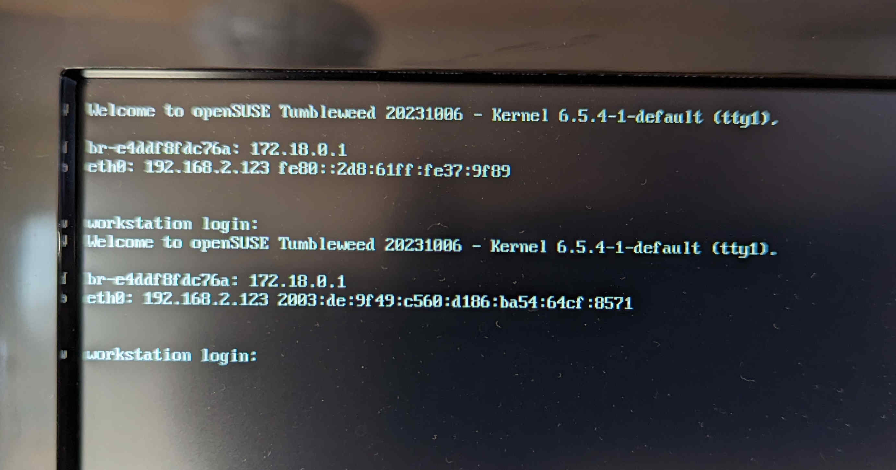

As you can tell from my previous posts, I do not like NVIDIA.
That is because I had a lot of issues with the drivers in the past and recently, the card started producing black flashes (see [this post]()).
So I finally made the switch to an AMD graphics card.

The setup was rather smooth.
OpenSUSE has two options for open source drivers for AMD cards and I chose the [Radeon driver](https://en.opensuse.org/SDB:Radeon).
The linked page lists a few commands that have to be run.
Only three of the commands were applicable for me.
```bash
init 3
modprobe radeon
reboot
```
I ran all of them without encountering errors and rebooted.

But then I was greeted with *this*


My first instinct was to remove the installed NVIDIA drivers (`zypper rm nvidia-compute-G06`) and remove the NVIDIA-specific options from the GRUB configuration.
But this did not resolve my issue.
Instead, reconfiguring Xorg did finally solve my issue.

Since the config was fresh I did need to add the infamous "TearFree" option (see [this wiki entry](https://linuxreviews.org/HOWTO_fix_screen_tearing)).
After this slight hiccup, I was all set.
Easy Peasy Lemon Squeezy.

<p style='text-align: center;'> <b> Or so I thought... </b> </p>

## Rendering Problems

A few weeks later I wanted to render a video and I hit my first real problem with the AMD drivers.
My plan was to put animated snowflakes over a photograph for a music mix I was planning (You can see the result [here](https://youtu.be/4mmXz0JKAyc?si=OOl86xqheUn6kbpO)).
First, I followed [a tutorial](https://youtu.be/Wv23dh6d3oE?si=1jJ1ZWWiiYUi9U5e) that made very simple snowflakes and render times were alright.
But in the video, the snowflakes were just hexagons.


But I wanted better.
So I looked for another tutorial and found a [great one](https://youtu.be/fcDFntILn0M?si=9HsBXMqiYBGs-CKd).


### GPU vs CPU Rendering

The only problem is that he uses a non-standard render engine called "cycles".
This render engine takes a lot longer than the standard render engine.
On my PC, each frame now took almost 3 seconds instead of 0.4 as with the hexagon shaped snowflakes.
With 20,000 frames to render, this was not sustainable.

One way to speed up the render is to render on the GPU instead of the CPU.
But this option was greyed out for me...
Turns out the Radeon driver does not support HIP, which is needed for rendering with cycles on the AMD card.

Time to search the interwebs for information on HIP...

### Trying to Install HIP

At first, my Google-Fu failed me.
But the I stumbeled across [this reddit post](https://www.reddit.com/r/openSUSE/comments/13vejus/blender_isnt_recognizing_my_radeon_6750xt/) where a user in the comments proposed a solution to my problem.
I followed the steps, which I had to adjust a little because of the age of the post and comments.
It didn't work, so I wrote a comment asking for help after trying different things myself.

During this conversation I learned about [opi](https://github.com/openSUSE/opi) for the first time.
It stands for OBS Package Installer, where OBS does *not* stand for Open Broadcast Service, but Open Build Service.
The Open Build Service allows users to host community packages for openSUSE online.
Previously, I added the repositories manually to install such packages, but this tool automates this process completely.
You just type in the program you want to install, opi will list all repositories that provide this software and installs the repository and the software after selecting the repository you want to use.

I used it to install 2 missing libraries:
- libffi_7
- libpython3_6m1

Now, hip did install successfully.
But I still could not select it in blender...

I then went ahead and tried installing different packages that were provided by AMD in the same repository but not included in the instructions in the comments of the reddit post, such as
- hip-amd-runtime
- hipsparselt, hipsparselt-devel
- every asan version of already installed hip related packages

Nothing seemed to work.
In the meantime I was also chatting with the legend that provided the steps thus far.
He suggested that I run `rocminfo` and have a look at the output.

```
ROCk module is loaded
Unable to open /dev/kfd read-write: Permission denied
fabi is not member of "render" group, the default DRM access group.
Users must be a member of the "render" group or another DRM access group
in order for ROCm applications to run successfully.
```

So in the end, the solution was to add myself to the render group...
After a quick `sudo usermod -aG render fabi`, rocm was finally up and running.
But blender still did not allow me to select HIP for GPU rendering :(
At this point I gave up.

### Thinking Outside the Box

- old graphics card inside server
- install gnome, nvidia drivers and blender on server
- even worse render times
gave up on cycles for now

- test EEVEE


