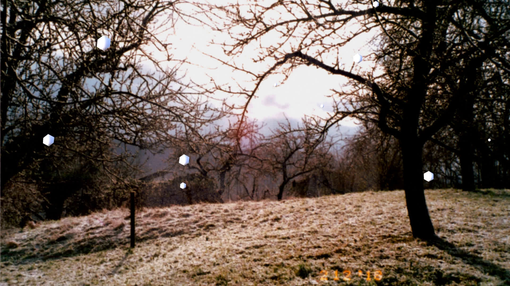

As you can tell from my previous posts, I do not like NVIDIA.
That is because I had a lot of issues with the drivers in the past and recently, the card started producing black flashes (see [this post]()).
So I finally made the switch to an AMD graphics card.

The setup was rather smooth.
OpenSUSE has two options for open source drivers for AMD cards and I chose the [Radeon driver](https://en.opensuse.org/SDB:Radeon).
The linked page lists a few commands that have to be run.
Only three of the commands were applicable for me.
```bash
init 3
modprobe radeon
reboot
```
I ran all of them without encountering errors and rebooted.

But then I was greeted with *this*


My first instinct was to remove the installed NVIDIA drivers (`zypper rm nvidia-compute-G06`) and remove the NVIDIA-specific options from the GRUB configuration.
But this did not resolve my issue.
Instead, reconfiguring Xorg did finally solve my issue.

Since the config was fresh I did need to add the infamous "TearFree" option (see [this wiki entry](https://linuxreviews.org/HOWTO_fix_screen_tearing)).
After this slight hiccup, I was all set.
Easy Peasy Lemon Squeezy.

<p style='text-align: center;'> <b> Or so I thought... </b> </p>

## Rendering Problems

A few weeks later I wanted to render a video and I hit my first real problem with the AMD drivers.
My plan was to put animated snowflakes over a photograph for a music mix I was planning (You can see the result [here](https://youtu.be/4mmXz0JKAyc?si=OOl86xqheUn6kbpO)).
First, I followed [a tutorial](https://youtu.be/Wv23dh6d3oE?si=1jJ1ZWWiiYUi9U5e) that made very simple snowflakes and render times were alright.
But in the video, the snowflakes were just hexagons.



But I wanted better.
So I looked for another tutorial and found a [great one](https://youtu.be/fcDFntILn0M?si=9HsBXMqiYBGs-CKd).


The only problem is that he uses a non-standard render engine called "cycles".
This render engine takes a lot longer than the standard render engine.
On my PC, each frame now took almost 3 seconds instead of 0.4 as with the hexagon shaped snowflakes.
With 20,000 frames to render, this was not sustainable.

One way to speed up the render is to render on the GPU instead of the CPU.
But this option was greyed out for me...
Turns out the Radeon driver does not support HIP, which is needed for rendering with cycles on the AMD card.

Time to search the interwebs for information on HIP...


- stumble upon reddit post
- first time using opi to install
    - libffi_7
    - libpython3_6m1

- installing additional packages
    - hip-amd-runtime
    - hipsparselt + -devel + every asan version of already installed hip related packages
    - 

- solution:
    - missed role render

- blender still not accepting
gave up

- old graphics card inside server
- install gnome, nvidia drivers and blender on server
- even worse render times
gave up on cycles for now

- test EEVEE


